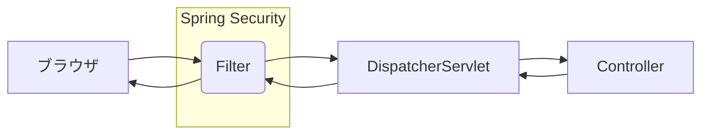

# SecurityFilterChain

作成日 2025/02/07

参照書籍 => P.172 "14.4 Spring Security の Filter" from 「プロになるための Spring 入門」



Security Filter Chain は 10 個以上存在するが、代表的なものは以下の 3 つ

- 認証を行う Filter
- リクエストの認可を行う Filter
- 例外をハンドリングする Filter

## 最新版(6.4.2)で動いたコード

参照サイト => [Spring Security 5.4〜6.0 でセキュリティ設定の書き方が大幅に変わる件](https://qiita.com/suke_masa/items/908805dd45df08ba28d8)

```java
@Configuration
@EnableWebSecurity
public class SecurityConfig {
    @Bean
    public SecurityFilterChain securityFilterChain(HttpSecurity http) throws Exception {
        http.formLogin(login -> login
            .loginProcessingUrl("/login")
            // .loginPage("/login") <-- デフォルトのログイン画面を使う
            .defaultSuccessUrl("/")
            .failureUrl("/login?error")
            .permitAll()
        ).logout(logout -> logout
            .logoutSuccessUrl("/")
        ).authorizeHttpRequests(authz -> authz
            .requestMatchers("/").permitAll()
            .requestMatchers("/token/**").hasRole("USER")
            .requestMatchers("/download/**").hasRole("USER")
            .anyRequest().authenticated()
        );
        return http.build();
    }
}
```
