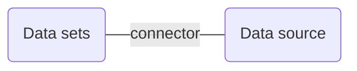

# 『Introduction to Data Studio』コースを受講する

作成日 2019/12/30、更新日 2020/01/01

## [0] コースに行き着く方法

-   [アナリティクス アカデミー](https://analytics.google.com/analytics/academy/)に行く
-   右下の言語を英語にする
-   "Introduction to Data Studio"コースをクリックする
-   Register する

2 回目以降

-   [アナリティクス アカデミー](https://analytics.google.com/analytics/academy/)のページに行く
-   右上にある自分のアイコン ＞ Analytics Academy Profile
-   Courses in progress コーナーに、"Introduction to Data Studio"がある
-   RETURN TO COURSE をクリックする

## [1] Welcome to Data Studio

### LESSON 1.1 Data Studio Overview

VIDEO

### LESSON 1.2 How Data Studio Works

Data set ... a system outside of Data Studio that contains the information on which you want to report

Dimesions ... data categories. e.g. Item Name, Color

Metrics ... measure the things contained in dimensions. e.g. Quantity Sold

Data sets are typically organized into rows and columns.

[About file upload \- Data Studio Help](https://support.google.com/datastudio/answer/7333350)

> コネクターがない場合は、無料で CSV ファイルをアップロード可能\
> CSV ファイルは、UTF-8 でカンマ区切り\
> 1 行目はヘッダー行。ヘッダーは重複させない\
> 100 データ、トータルサイズ 2GB といった制限あり

### LESSON 1.3 Access controls

-   Permissions ... 誰が私のファイルを閲覧・編集可能か？
-   Credentials ... 誰がレポートの中のデータを閲覧可能か？

report access permissions

-   Owner Access ... complete control over a report
-   Edit Access ... create or edit charts, controls and other design elements within the report.
-   View Access .. view and interact with your report

data source permissions

-   Owner Access
-   Edit Access
-   View Access

data source credentials

-   Owner's Credentials ... データソースへのアクセス権がなくてもレポートを見られるようにする
-   Viewer's Credentials ... データソースへのアクセス権がなければレポートは見られない

## [2] Navivate Data Studio

### LESSON 2.1 Data Studio Home page

DEMO

### LESSON 2.2 Data source overview

カラム一覧

-   Index
-   Field
-   Type
-   Aggregation
-   Description (optional)

Field にある縦 3 ドット

-   Count ... 数えて新しいフィールドを作成する
-   Count Distinct ... ユニークな値だけを数えて新しいフィールドを作成する
-   Duplicate ... フィールドを複製する
-   Disable ... 使用できないようにする
-   Remove ... 削除する

Type で選択可能な種類

-   Numeric
-   Text
-   Date & Time
-   Boolean
-   Geo
-   Currency
-   URL

Aggregation で選択可能な種類

-   Average
-   Count
-   Count Distinct
-   Max
-   Min
-   Sum
-   Auto
-   None

カラム一覧の上に、Data source の設定がある

-   Data Credentials
    -   Owner ... レポートを閲覧・編集できる人は、図でこのデータを見られる
    -   Viewer ... ユーザーはデータセットの閲覧権もないと図が表示されない
-   Community Visualizations Access ... サードパーティ開発者が作成した図がデータにアクセスできるかどうか
-   field Editing in Reports ... デフォルト ON

### LESSON 2.3 Report overview

-   左枠 ... ページナビゲーションメニュー。レポートは複数ページを持つ
-   右上 ... アクションの提示
    -   Download the report
    -   View it full-screen
    -   Refresh the data
    -   Make a copy of the report
    -   Share it with others
    -   Edit button
    -   Switch Google products
    -   Switch Google accounts
-   左下 ... Data Last Updated

レポートに配置できるもの

-   Table ... サマリーのテーブル表示
-   Charts ... bar, line, pie and table charts
-   Scorecard ... サマリーの一発表示
-   Controls ... Dimention の変更
-   Shape ... 上にあるものを目立たせる
-   Image
-   Text

### LESSON 2.4 Report edit mode overview

サイドパネルの種類

-   Layout タブ ... 全体の外観を設定する
    -   Header Visibility ... ヘッダーにはタイトル・共有ボタン・編集ボタンがある
    -   Navigation position ... 左かトップか
    -   Display mode ... ブラウザの横幅に合わせるか、常に実サイズで表示するか
    -   Canvas Size ... プリセットを選択するか、カスタムするか
    -   Grid Settings ... 最小サイズは 10px
    -   Report-level component position ... 他のコンポーネントを動的に変化させる
-   Theme タブ ... 全体のテーマ（色、フォントサイズ、フォントタイプ、枠、影）を設定する

各コンポーネントを設定する

-   mouse ... セレクションモードに入る
-   undo
-   redo
-   Add a chart
-   Date range control
-   Filter control
-   Data control
-   Embeded content
-   Text boxes
-   Images
-   shapes rectanble
-   Shapes circle

Chart を選択したときに登場するサイドパネル

-   Data タブ
    -   Data Source ... one data source or blend data from multiple sources
    -   Fields ... dimensions and metrics
    -   Data Range
    -   Filters
-   Style タブ

## [3] Build your first report

### LESSON 3.1 Connect Data

Choose Google Sheets > Select Spreadsheet and Worksheet\
Options are "Use first row as headers" and "Include hidden and filtered cells"\
Click connect button > go to Data source edit screen

### LESSON 3.2 Create a new report and add charts

Date Dimension のカレンダーアイコンをクリックして、Auto を Year Week に変更すると、\
表示ポイントが減って、グラフが見やすくなる

`sum(revenue)-sum(cost)`のような集計の計算式も、新しい計算セルの中に入れてよい\
スコアカードで、そのセルを選ぶと、集計された結果が表示される

コンポーネントを選択してから、arrange メニューを選ぶと、\
"Make report-level"で、全ページに表示させることができる

### LESSON 3.3 Add and configure report controls

コントロールの種類

-   Data range control
-   Filter control
-   Data control

コントロールは、デフォルトで、そのページにあるコンポーネントすべてを従わせようとする

### LESSON 3.4 Share reports with others

pencil icon > "Can edit" or "Can view" > select "Can view" > changed to eye icon

advanced link > Check "Prevents editors from changing access and adding new people"

## [4] Format and Design Reports

### LESSON 4.1 Data visualization basics

1. Begin with a high-level view, and then progressively zoom in
1. Treat related items similarly, and style different items differently
1. User color strategically
1. Use a consistent theme
1. Choose the right charts for your purpose

Example Report

-   ユーザーが最初に見るのは、ウェブサイトのトラフィックと収入である
-   収入は緑にする。この色はお金や獲得に結びついている
-   重要な個々のパフォーマンスメトリクスは座布団の上に大きく配置する
-   Filter control, Data range control は、右上に置く
-   特定の商品に関する情報はページの下に置き、しかも 5 つに絞る
-   デバイス別、地理別のパフォーマンスは最後に知らせる
-   Product add to cart, cart-to-detail rate は同じに指標なので同じ色

Chart purposes

-   Compare dimensions or categories => Bar charts
-   Track changes or trends over time => Line chart
-   Highlight a single, critical metric => Scorecard
-   Understand the composition of a whole set of data => Pie charts
-   Visualize data in the real world => geo map
-   Discover relationship between variables => Scatter and bubble charts
-   See how well your data perfomes against a targe => bullet chart (thermometer graph)

### LESSON 4.2 Create and use report templates

空白
