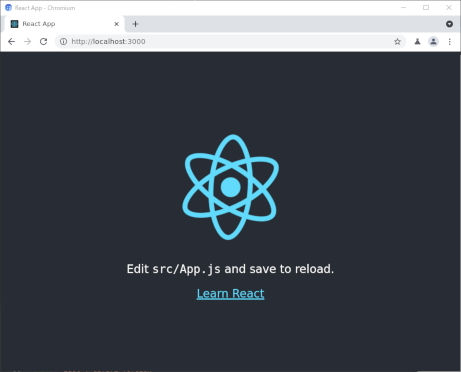

# Create React App

作成日 2021/05/14、更新日 2021/07/03

## 01. Create React App とは

公式サイト => [Create React App](https://create-react-app.dev/)

> Set up a modern web app by running one command.

### Getting Started を読む

[Getting Started \| Create React App](https://create-react-app.dev/docs/getting-started)

> Create React App is an officially supported way to create single-page React applications. It offers a modern build setup with no configuration.

事前のインストールは不要。npx コマンドは常に最新のバージョンを取得してきてから、そのコマンドを使う

```bash
npx create-react-app my-app
cd my-app
npm start
# => ブラウザで http://localhost:3000 ページを開く
```



### Adding TypeScript を読む

[Adding TypeScript \| Create React App](https://create-react-app.dev/docs/adding-typescript/)

> To start a new Create React App project with TypeScript, you can run:

```bash
npx create-react-app my-app --template typescript
```

## 02. 実際に create-react-app コマンドを使ってみる

```bash
node -v
# => v14.17.2
npm -v
# => 7.19.1

npx create-react-app avocado --template typescript
```

### 出来上がったアプリのファイル・フォルダ構造

```text
--avocado/
    |--public/
    |   |--favicon.ico
    |   |--index.html
    |   |--logo192.png
    |   |--logo512.png
    |   |--manifest.json
    |   `--robots.txt
    |--src/
    |   |--App.css
    |   |--App.test.tsx
    |   |--App.tsx
    |   |--index.css
    |   |--index.tsx
    |   |--logo.svg
    |   |--react-app-env.d.ts
    |   |--reportWebVitals.ts
    |   `--setupTests.ts
    |--package.json
    `--tsconfig.json
```

### インストールされたパッケージ

package.json の一部

```json
{
  "dependencies": {
    "@testing-library/jest-dom": "^5.14.1",
    "@testing-library/react": "^11.2.7",
    "@testing-library/user-event": "^12.8.3",
    "@types/jest": "^26.0.23",
    "@types/node": "^12.20.15",
    "@types/react": "^17.0.13",
    "@types/react-dom": "^17.0.8",
    "react": "^17.0.2",
    "react-dom": "^17.0.2",
    "react-scripts": "4.0.3",
    "typescript": "^4.3.5",
    "web-vitals": "^1.1.2"
  }
}
```

### 登録済みのスクリプト

package.json の一部

```json
{
  "scripts": {
    "start": "react-scripts start",
    "build": "react-scripts build",
    "test": "react-scripts test",
    "eject": "react-scripts eject"
  }
}
```

react-scripts が create-react-app コマンドの本体であることがわかった

[https://www.npmjs.com/package/react-scripts](https://www.npmjs.com/package/react-scripts)

> This package includes scripts and configuration used by Create React App.

### TypeScriptの設定

tsconfig.json

```JSON
{
  "compilerOptions": {
    "target": "es5",
    "lib": [
      "dom",
      "dom.iterable",
      "esnext"
    ],
    "allowJs": true,
    "skipLibCheck": true,
    "esModuleInterop": true,
    "allowSyntheticDefaultImports": true,
    "strict": true,
    "forceConsistentCasingInFileNames": true,
    "noFallthroughCasesInSwitch": true,
    "module": "esnext",
    "moduleResolution": "node",
    "resolveJsonModule": true,
    "isolatedModules": true,
    "noEmit": true,
    "jsx": "react-jsx"
  },
  "include": [
    "src"
  ]
}
```
