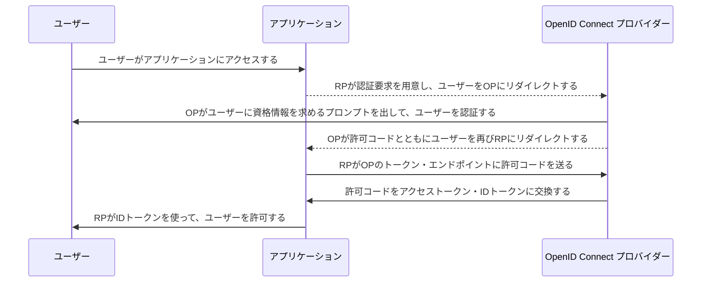
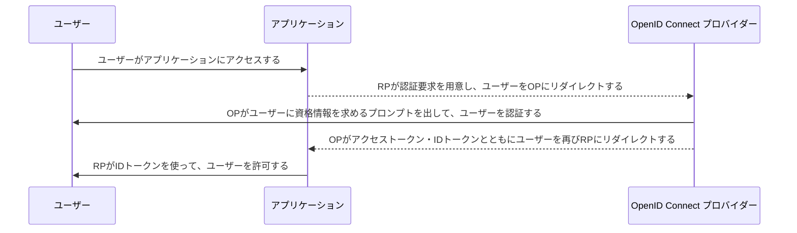

# OpenID Connect, OAuth2.0

作成日 2019/11/26

## 01. OpenID Connect (OIDC)とは

[OpenID Connectの始め方 \- Qiita](https://qiita.com/sawadashota/items/d7b794c155d01c319b04)

>OpenID Connectは、OAuth2.0をベースに作られているので、まずはOAuth2.0を理解するところから始めましょう。\
>OpenID Connectは、OAuth2.0に認証レイヤーを追加したものです。もっと言うと、OAuth2.0で標準化されていないID連携の部分を標準化したものです。

[IBM Knowledge Center \- OpenID Connect](https://www.ibm.com/support/knowledgecenter/ja/SSEQTP_liberty/com.ibm.websphere.wlp.doc/ae/cwlp_openid_connect.html)

>OpenID Connectは、OAuth2.0プロトコルに基づいて構築された、単純なID プロトコルおよびオープン・スタンダードです。これにより、クライアント・アプリケーションは、OpenID Connectプロバイダーによって実行された認証を利用してユーザーのIDを検証できます。\
>OpenID Connectは、認証および許可にOAuth 2.0を使用し、ユーザーを一意的に識別するIDを作成します。クライアント・アプリケーションは、OpenID Connectプロバイダーから相互運用可能なRESTのような方法で、ユーザーに関する基本プロファイル情報を取得することもできます。

- アクセス・トークン ... 保護リソースにアクセスするために使用される資格情報。アクセス・トークンは、クライアントに発行された許可を表すストリングです。
- 許可エンドポイント ... ユーザーの認証および許可を実行するためにクライアントからの許可要求を受け入れる、OpenID プロバイダー上のリソース。許可エンドポイントは、許可コード・フローでクライアントに許可付与 (許可コード) を返します。暗黙的フローでは、許可エンドポイントは、ID トークンおよびアクセス・トークンをクライアントに返します。
- IDトークン ... 認証済みユーザーに関するクレームが含まれている JSON Web トークン (JWT)。
- クレーム ... エンティティーに関して表明された情報。クレームの例としては、電話番号、名、姓などがあります。
- OP ... Open ID Connectプロバイダー、クライアントまたはリライング・パーティー (RP) にクレームを提供できる OAuth 2.0 許可サーバー。
- RP ... リライティングプロバイダー、OpenID Connect クライアントとして構成されている Liberty サーバー、または OpenID プロバイダー (OP) にクレームを要求するクライアント・アプリケーションのいずれか。
- トークン・エンドポイント ... アクセス・トークン、ID トークン、およびリフレッシュ・トークンと交換に、クライアントから許可付与 (許可コード) を受け入れる、OP 上のリソース。

## 02. OAuth 2.0とは

RFCが策定した、3rdパーティに限定的なリソースアクセスを可能にする認可フレームワーク

[OAuth 2\.0 全フローの図解と動画 \- Qiita](https://qiita.com/TakahikoKawasaki/items/200951e5b5929f840a1f)

>RFC 6749(The OAuth 2.0 Authorization Framework)で定義されている4つの認可フロー、および、リフレッシュトークンを用いてアクセストークンの再発行を受けるフローの図解及び動画です。

1. 認可コードフロー ... 認可エンドポイントに認可リクエストを投げ、応答として短命の認可コードを受け取り、その認可コードをトークンエンドポイントでアクセストークンと交換するフロー
1. インプリシットフロー ... 認可エンドポイントに認可リクエストを投げ、応答として直接アクセストークンを受け取るフロー
1. リソースオーナー・パスワード・クレデンシャルズフロー ... トークンエンドポイントにトークンリクエストを投げ、応答としてアクセストークンを受け取るフロー。OAuthのフローだが、クライアントアプリケーションがユーザーのIDとパスワードを受け取る
1. クライアント・クレデンシャルズフロー ... トークンエンドポイントにトークンリクエストを投げ、応答としてアクセストークンを受け取るフロー。ユーザーの認証はおこなわれず、クライアントアプリケーションの認証のみがおこなわれる
1. リフレッシュトークンフロー ... 事前に発行を受けていたリフレッシュトークンをトークンエンドポイントに提示することにより、アクセストークンの再発行を受ける

### 許可コード・フロー

OpenID Connectの標準的なフロー

### 暗黙的フロー

暗黙的フローは、OpenID Connectプロバイダーとして機能している Liberty サーバーでのみサポートされます。

## 03.『OAuth 2.0をはじめよう』を読む

## OpenID Certifiedされている、主なWebサービス

[OpenID Certification – OpenID](https://openid.net/certification/)

- Auth0 - Auth0 ... Basic OP, Implicit OP, Hybrid OP, Config OP
- Authelete - Authlete 1.1 ... Basic OP, Implicit OP, Hybrid OP, Config OP
- Google - Google Federated Identity ... Basic OP, Implicit OP, Hybrid OP, Config OP
- LINE - LINE Login ... Basic OP
- Microsoft - ADFS on Windows Server 2016 ... Basic OP, Implicit OP, Config OP
- Microsoft - Azure Active Directory ... Config OP
- NEC - NC7000-3A-OC ... Basic OP
- PayPal - Login with PayPal ... Config OP
- Recruit - Recruit ID ... Basic OP
- Yahoo! Japan - Yahoo! ID Federation v2 ... Basic OP, Implicit OP, Hybrid OP, Config OP

[OpenID Connect 対応してるWebサービス/製品のログイン認証関連のドキュメントリンク集 \- Qiita](https://qiita.com/minamijoyo/items/62c90abd7785820705eb)

- [Google Identity Platform](https://developers.google.com/identity/protocols/OpenIDConnect)
- [LINEログイン](https://developers.line.me/ja/docs/line-login/overview/)
- [Yahoo! ID連携](https://developer.yahoo.co.jp/yconnect/)
- [Yahoo! JAPANのOpenID Certified Mark取得について](https://www.slideshare.net/kura_lab/yahoo-japanopenid-certified-mark)

## 04. Open ID Connectの実装（Node.js編）

[Node\.jsでOpenID ConnectのOPとRPを実装してみた \- Qiita](https://qiita.com/moomooya/items/97864e1078a3cc204c17)

[oidc\-provider \- npm](https://www.npmjs.com/package/oidc-provider)

[auth0\-js \- npm](https://www.npmjs.com/package/auth0-js)
