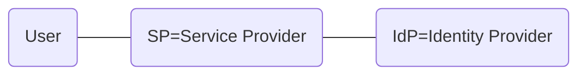

# シングルサインオン

作成日 2019/11/26

## 01. シングルサインオン（SSO, Single Sign-On）とは

1つのログインIDとパスワードで、複数のWebサービスにログインできる仕組み

## 02. SSOの仕組み

- エージェント方式 ... Webアプリにエージェントを導入、Cookieを利用
- リバースプロキシ方式 ... リバースプロキシサーバーを設置、そこにエージェントを導入
- 代理認証方式 ... ユーザーの代わりにID/パスワードを送信
- フェデレーション方式 ... SAML, OpenID Connectを使う

## 03. IDaaSの紹介

### 比較記事を読む

[IDaaSの比較 \(Cognito, Firebase Authentication, Auth0\) \- Qiita](https://qiita.com/ibuki/items/9c47df0cc4e9ee6ca0bc)

> Cognito User Pools, Firebase Authentication, Auth0の3つを比較する

[最近流行り\(?\)のIDaaSについてまとめます \- Qiita](https://qiita.com/osak/items/28eda07e5d0183c6f99a)

> - SAML ... 企業内やより高いセキュリティを求められるシステムで利用する
> - OpenIDconnect ... 不特定多数のコンシューマが使うアプリでよく利用される
> - OAuth ... WepAPIなどに利用
>
> 複数のアプリがある場合、同じIDaaSを利用すれば、一回のログインで、すべてのアプリへの遷移が可能
> 
> - Okta ... IDaaS最大手
> - Auzure Active Directory
> - Oracle Identity Cloud Service
> - OneLogin
> - AWS Single Sign-On
> - TrustLogin
> - Auth0
