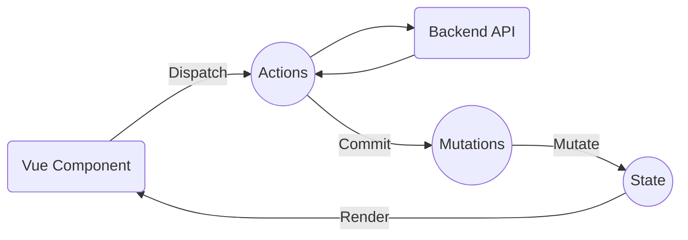

# [Vuex アクション](https://vuex.vuejs.org/ja/guide/actions.html)

作成日 2019/02/20

- アクションは状態を変更しない、ミューテーションをコミットする
- アクションは任意の非同期処理を含むことができる

```js
export default {
  namespaced: true,
  state: {
    list: []
  },
  mutations: {
    updateList(state, newList) {
      state.list = newList;
    }
  },
  actions: {
    getNow(context) {
      const list = [];
      context.commit("updateList", list);
    }
  }
};
```

引数に取るコンテクストオブジェクトは、ローカルを対象としているので、
ミーテーション名に名前空間は不要

コンテクストオブジェクトはストアインスタンスそのものではない

## Vuex の考え方

Actions, Mutations, state の 3 つが、決まった作法で、
順繰りに呼び出していく



- Vue Component は、Dispatch メソッドを使って、Actions を動かす
- Actions は、非同期な処理が可能
- Actions の中で、Commit メソッドを使って、Mutations を動かす
- Mutations は、State を変更する
- State が変更されると、Vue Component がレンダーされる

## コンポーネント内でのアクションのディスパッチ

`store.dispatch`は Promise を返すので、アクションが完了してから
ストアの状態をコンポーネントの変数に入れることができる

```js
this.$store.dispatch("contacts/getNow").then(() => {
  this.contactList = this.$store.state.contacts.list;
});
```

## ディスパッチで値を与えるには

第二引数がオブジェクトになっているので、その中に入れる

```js
// FILE: modules/auth.js
export default {
  actions: {
    login(context, payload) {
      context.commit("update", payload.token);
    }
  }
};

// FILE: pages/login.js
this.$store.dispatch("auth/login", { token: "あぶらかたぶら" });
```

## 他のモジュールのディスパッチを呼ぶには

第三引数に`{root: true}`を入れて、
自分はルートから呼んでいることを宣言し、
アクション名の指定のところで、名前空間を冒頭に入れる

```js
// FILE: modules/auth.js
export default {
  actions: {
    login(context, payload) {
      context.commit("update", payload.token);
      context.dispatch("conferences/fetch", null, { root: true });
    }
  }
};
```

## より複雑な非同期処理を取り扱うには

アクションが Promise を返せばいい

```js
actions: {
    actionA (context) {
        return new Promise((resolve, reject) => {
            commit('someMutation');
            resolve();
        });
    }
}

// 別のコンポーネント、またはアクションで、thenが使える
store.dispatch('actionA').then(()=>{});
```

すべてのアクションが Promise を返すならば、async/await が使える

```js
actions: {
    async actionA (context) {
        commit('gotData', await getData());
        // getData()はPromiseを返すことを想定
    },
    async actionB (context) {
        await dispatch('actionA');
        commit('gotOtherData', await getOtherData());
        // getOtherData()はPromiseを返すことを想定
    }
}
```

[Vue\.js \+ Vuex \+ async/await で非同期処理 \- Qiita](https://qiita.com/superyusuke/items/0d71a8e741dd72833b26)

> async/await シンタックスを書くことで、非同期処理を「あたかも同期処理のように上から下へと希望する処理順と同じように書くことができる。これはあくまで見た目であって、非同期処理は非同期処理である。内部的には Promise である。
