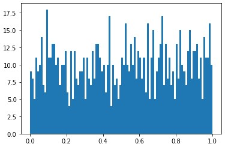
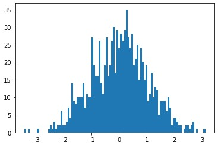

# Numpy で乱数を生成する

作成日 2021/03/18

## 01. `numpy.random.random()` メソッド

0 から 1 までの間で乱数を生成させる

[numpy\.random\.random — NumPy v1\.20 Manual](https://numpy.org/doc/stable/reference/random/generated/numpy.random.random.html)

引数解説

- `size` ... 生成させる乱数の個数を指定する

```python
import numpy as np

random_list = np.random.random(size=10)
print(random_list)
# => [0.33960189 0.107005   0.01269859 0.52334031 0.22538519 0.17609073 0.51815465 0.29398549 0.07064391 0.50628555]
```

グラフにすると、0 から 1 までの間でいい感じで分散している

```python
from matplotlib import pyplot as plt
import numpy as np

random_list = np.random.random(size=1000)
plt.hist(random_list, bins=100)
plt.show()
```



## 02. `numpy.random.randn()` メソッド

平均 0、標準偏差 1 の正規分布になるように乱数を生成させる

[numpy\.random\.randn — NumPy v1\.20 Manual](https://numpy.org/doc/stable/reference/random/generated/numpy.random.randn.html)

引数解説

- `d0,d1,..., dn` ... n 次元の、それぞれの生成させる乱数の個数を指定する

```python
import numpy as np

random_list = np.random.randn(10)
print(random_list)
# => [-0.79612451 -1.12216445 -1.92452505  1.18805342 -0.10658118  2.74718346  0.46345531  1.75905261  1.06380765 -0.93397174]
```

グラフにすると、0 を中心とした正規分布ができる

```python
from matplotlib import pyplot as plt
import numpy as np

random_list = np.random.randn(1000)
plt.hist(random_list, bins=100)
plt.show()
```


