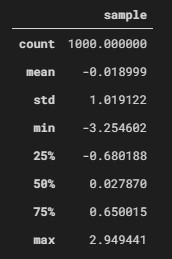

# DataFrame を「見える化」する

作成日 2021/03/18

## `DataFrame.describe()` メソッド

データの分布具合を記述統計で示す

[pandas\.DataFrame\.describe — pandas 1\.2\.3 documentation](https://pandas.pydata.org/docs/reference/api/pandas.DataFrame.describe.html)

```python
import numpy as np
import pandas as pd

df1 = pd.DataFrame({'sample': np.random.randn(1000)})
df1.describe()
```



記述統計の意味

- `count` ... データの個数
- `mean` ... 平均値
- `std` ... 標準偏差
- `min` ... 最小値
- `25%` ... 第 1 四分位数
- `50%` ... 第 2 四分位数（中央値）
- `75%` ... 第 3 四分位数
- `max` ... 最大値
