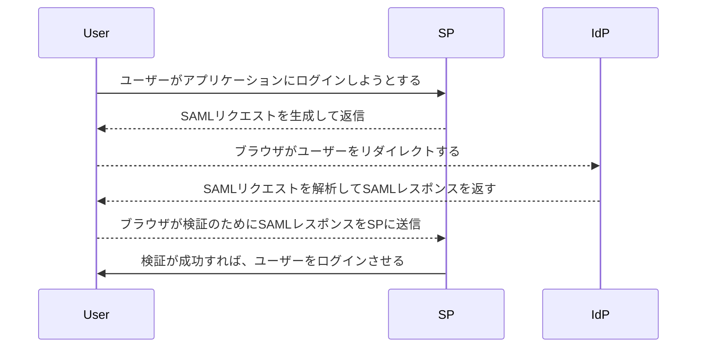

# SAML

作成日 2019/11/09、更新日 2019/11/12

## 01. SAMLとは

SAML = Security Assertion Markup Language

ユーザーの認証や属性、認可に関する情報を記述するマークアップ言語

SAMLを使えば、クッキーを利用せずに認証情報の伝達が可能

## 02. 参考記事1を読む
[SAMLとは ｜クラウド型シングルサインオン・アクセスコントロール（IDaaS） OneLogin \- サイバネット](https://www.cybernet.co.jp/onelogin/function/saml.html)

> SAML = Security Assertion Markup Language
> OASISによって策定された、ユーザー認証のための規格
> SAMLを利用することで、ひとつのディレクトリで、複数のサービスへのログインへのシングルサインオンを
> 実現する。また、ユーザーの属性情報なども付与することが可能

- Authentication ... 本人認証 
- Authorization ... 利用認可

> 認証情報を提供する側 => IdP (Identity Provider)
> 認証情報を利用する側 => SP (Service Provider)

## 03. 参考記事2を読む

[SAML 認証はどのように機能するか？](https://auth0.com/blog/jp-how-saml-authentication-works/)

SAML は標準 シングル サインオン(SSO)形式です。認証情報はデジタル署名した XML 文書を通じて交換します。

- Identity Provider (Auth0)
- Service Provider (Zagadatと呼ばれる企業HRポータル)

アプリケーションでのSAML認証のプロセスフローをよく見てみましょう

## 04. OpenIDとSAMLの違い

[やさしい言葉で理解するSAML認証のまとめ \- Qiita](https://qiita.com/pasta_kun/items/4a57bd3b71ac8bf5d736)

>- OpenIDとくらべてSAMLの方が連携するための敷居が高い
>- SAMLではそもそも連携するかどうかユーザの選択権がない
>- SAMLではユーザが実際にログイン情報を渡すサービスを選べない
>
>SAML認証には強制力があるため "すべてのユーザに利用させたい" 場合に向いている\
>そのため企業や団体など組織単位で利用するサービスに使われるケースが多い
