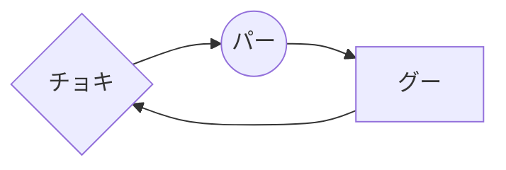
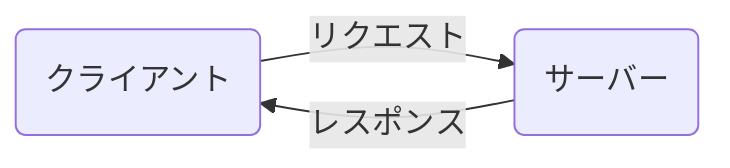
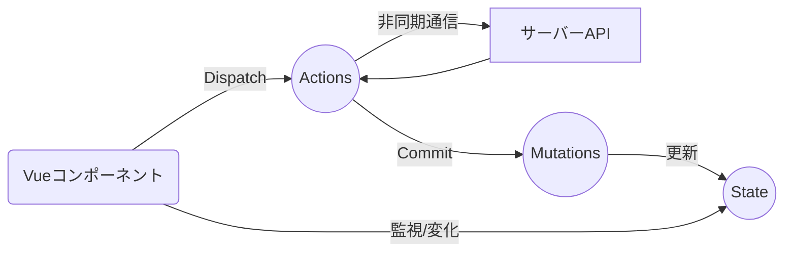
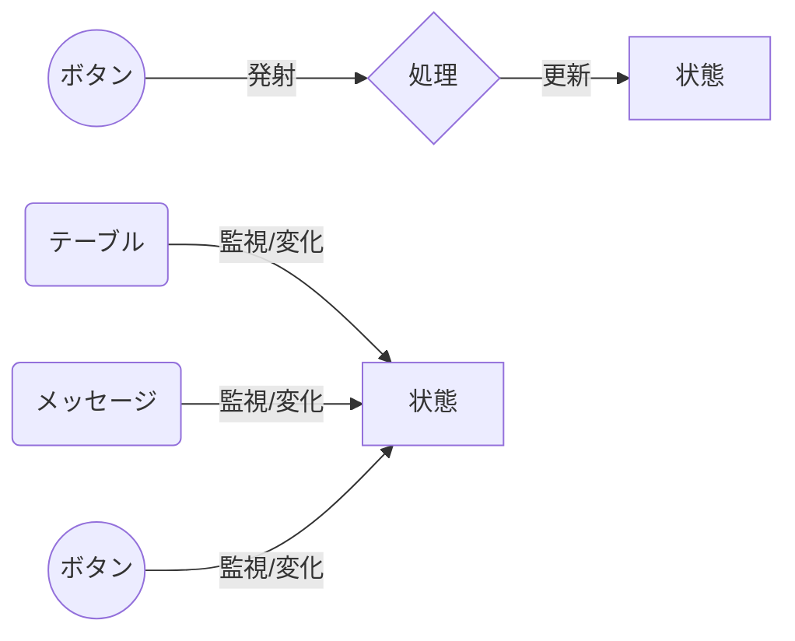
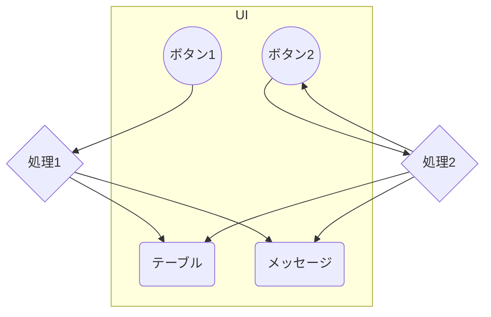
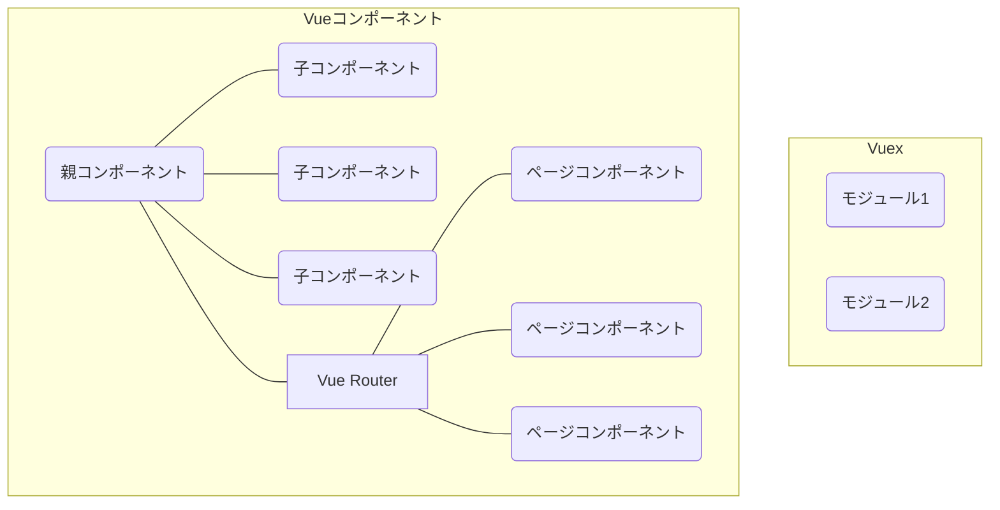
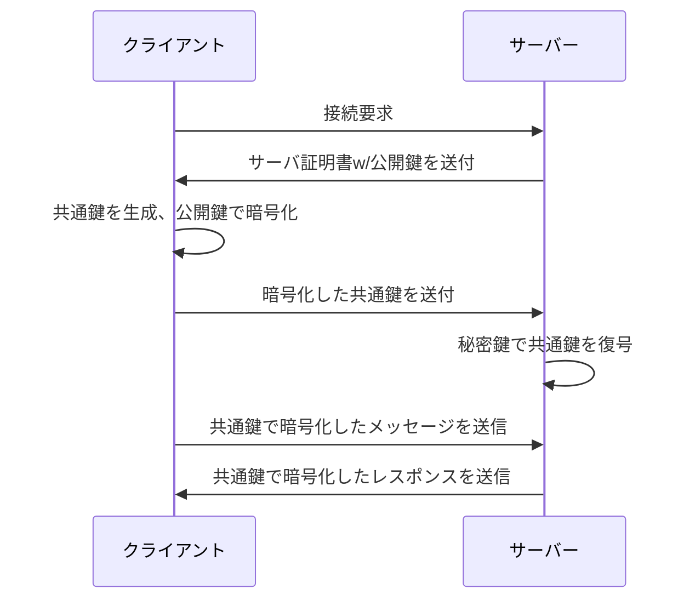

# Mermaid で図を作成する

作成日 2025/02/06、更新日 2025/04/26

## 1. Mermaid とは

公式サイト（英語） => [Mermaid | Diagramming and charting tool](https://mermaid.js.org/)

```text
graph LR
A{チョキ} --> B((パー))
B --> C[グー]
C --> A
```



## 2. Mermaid の文法

### 冒頭の宣言

- `graph TB` ... 上から下に描画する
- `graph LR` ... 左から右に描画する

### 要素をつくる

- `A[apple]` ... 四角形の要素をつくる
- `A(apple)` ... 角丸な四角形の要素をつくる
- `A{apple}` ... 菱形の要素をつくる
- `A((apple))` ... 円形の要素をつくる

### 要素と要素を結ぶ

- `A---B` ... A と B を直線で結ぶ
- `A-.-B` ... A と B を破線で結ぶ
- `A===B` ... A と B を太線で結ぶ
- `A-->B` ... A と B を直線矢印で結ぶ
- `A-.->B` ... A と B を破線矢印で結ぶ
- `A==>B` ... A と B を太線矢印で結ぶ
- `A-->|comment|B` ... 結び線にコメントを入れる

### その他

- `subgraph comment` ... 背景を描き始める
- `end` ... 背景を描き終わる
- `;` ... 一行を分けるときに使う、文末は不要

## 3. VSCode と Mermaid

コードブロックの言語指定を`mermaid`にすると、Markdown Preview Enhanced のプレビュー画面で図が表示される

## 4. Mermaid 作品集

### API



### Vue.js Vuex



### Vue.js State



### UI



### Vue.js diagram



### SSL Handshake


