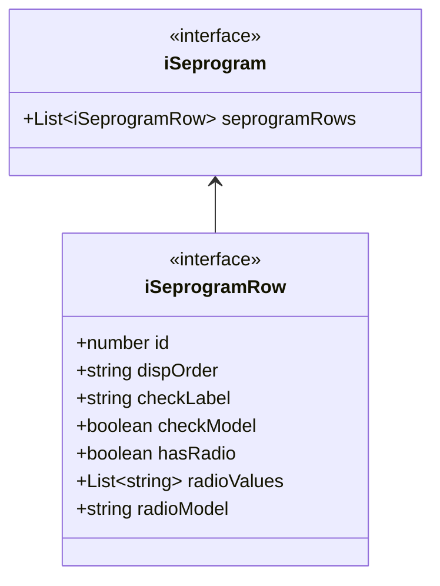

# Mermaidでクラス図を描く

作成日 2025/04/28、更新日 2025/07/07

ユーザーガイド（英語） => [Class diagrams](https://mermaid.js.org/syntax/classDiagram.html)

## クラス図で使う記号

Visibility

| Type | Description |
| ---- | ----------- |
| `+`  | Public      |
| `-`  | Private     |

Relation

| Type  | Description     |
| ----- | --------------- |
| `-->` | Association (※) |

※ 直接アソシエーション: オブジェクトがフィールドにある別のオブジェクトを含む場合に限る
